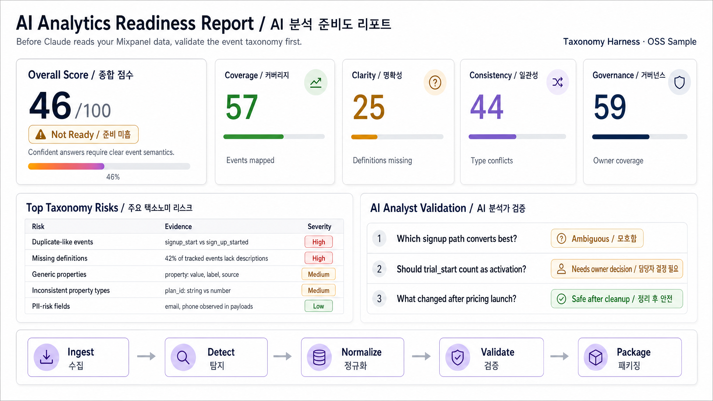

# Taxonomy Harness / 택소노미 하네스

> **EN** Before Claude reads your Mixpanel data, make sure your event taxonomy is a language Claude can understand.  
> **KR** Claude가 Mixpanel 데이터를 읽기 전에, 이벤트 택소노미가 Claude가 오해 없이 읽을 수 있는 언어인지 먼저 확인하세요.

Taxonomy Harness is an open-source starter kit for making product analytics data **AI-readable**. It helps product, growth, and data teams diagnose messy event taxonomies, produce lightweight data contracts, and prepare for AI analyst workflows with Claude, Mixpanel MCP, or exported analytics data.

Taxonomy Harness는 제품 분석 데이터를 **AI가 읽을 수 있는 형태**로 정리하기 위한 오픈소스 스타터 킷입니다. 제품팀, 그로스팀, 데이터팀이 불명확한 이벤트 택소노미를 진단하고, 가벼운 데이터 계약(data contract)을 만들고, Claude / Mixpanel MCP / 분석 데이터 export 기반의 AI analyst workflow를 준비할 수 있게 돕습니다.

---

## Why this exists / 왜 필요한가

### EN

AI analytics is entering a new phase. Instead of only looking at dashboards, teams can now ask AI analysts questions directly:

- “Why did activation drop last week?”
- “Which acquisition channels convert best?”
- “Where do users fall out of the onboarding funnel?”
- “What changed in behavior after this release?”

With tools like Claude, MCP, and product analytics connectors, it is becoming easy for AI to read Mixpanel, Amplitude, GA4, or warehouse data.

But there is a hidden problem: **AI does not know your event semantics unless your taxonomy says them clearly.**

If your event taxonomy is messy, AI can still produce fluent answers. The dangerous part is that those answers may be confidently wrong.

For example:

- `signup`, `register`, and `complete_signup` may all look like account creation, but only one might mean activated user.
- `view_pricing` and `pricing_viewed` may represent the same event, or two different tracking implementations.
- `source`, `utm_source`, and `channel` may be mixed across events with different meanings.
- `status` may be a string in one event and a boolean in another.
- Deprecated events may still fire in production.
- Funnel stages may live in someone’s head instead of in a machine-readable contract.

In the dashboard era, taxonomy debt was mostly an internal analytics hygiene problem. In the AI analyst era, it becomes a trust and safety problem.

**Before asking AI to analyze product data, teams need to verify whether the data is expressed in a language AI can safely read.**

That is the purpose of Taxonomy Harness.

### KR

제품 분석은 새로운 단계로 넘어가고 있습니다. 이제 팀은 대시보드를 직접 뒤지는 대신 AI analyst에게 바로 질문할 수 있습니다.

- “지난주 activation이 왜 떨어졌지?”
- “어떤 acquisition channel이 가장 전환이 좋지?”
- “온보딩 퍼널에서 사용자는 어디서 이탈하지?”
- “이번 릴리즈 이후 행동이 어떻게 바뀌었지?”

Claude, MCP, 제품 분석 커넥터가 등장하면서 AI가 Mixpanel, Amplitude, GA4, warehouse 데이터를 직접 읽는 일이 쉬워지고 있습니다.

하지만 숨은 문제가 있습니다. **AI는 이벤트의 의미를 스스로 아는 것이 아니라, 택소노미에 적힌 의미를 읽습니다.**

이벤트 택소노미가 지저분해도 AI는 매우 그럴듯한 답을 만들 수 있습니다. 더 위험한 점은, 그 답이 틀렸는데도 확신 있게 보일 수 있다는 것입니다.

예를 들어:

- `signup`, `register`, `complete_signup`이 모두 계정 생성을 뜻하는 것처럼 보이지만, 실제로는 그중 하나만 activation을 의미할 수 있습니다.
- `view_pricing`과 `pricing_viewed`가 같은 이벤트일 수도 있고, 서로 다른 구현의 흔적일 수도 있습니다.
- `source`, `utm_source`, `channel`이 이벤트마다 다른 의미로 섞여 있을 수 있습니다.
- `status`가 어떤 이벤트에서는 문자열이고, 다른 이벤트에서는 boolean일 수 있습니다.
- deprecated event가 여전히 production에서 발생하고 있을 수 있습니다.
- 퍼널 단계 정의가 문서가 아니라 특정 담당자의 머릿속에만 있을 수 있습니다.

대시보드 시대의 taxonomy debt는 주로 내부 분석 위생 문제였습니다. 하지만 AI analyst 시대에는 이것이 신뢰와 안전의 문제가 됩니다.

**AI에게 제품 데이터를 분석하게 하기 전에, 그 데이터가 AI가 안전하게 읽을 수 있는 언어로 표현되어 있는지 확인해야 합니다.**

Taxonomy Harness는 바로 그 목적을 위해 만들어졌습니다.

---

## Scope: what this checks / 범위: 무엇을 점검하는가

### EN

Taxonomy Harness is a **preflight checker for Mixpanel Lexicon / event dictionary exports**. It checks whether your analytics vocabulary is readable, consistent, and safe enough for AI-assisted analytics workflows.

It checks:

- Event names that are hard for humans or AI to distinguish.
- Missing or weak event/property descriptions.
- Generic property names such as `source`, `type`, or `status`.
- Inconsistent property types across events.
- Deprecated events that still appear active when volume metadata is available.
- PII-risk candidates such as email, phone, address, birthday, or identifier-like fields.
- Optional governance gaps such as missing owners, when owner fields exist in the export.

It does **not** check:

- Duplicate event firing in production.
- Null rates, value distributions, or property cardinality.
- Timestamp quality.
- Identity stitching.
- Event volume anomalies.
- Whether instrumentation code is implemented correctly.
- Legal/privacy compliance. PII findings are candidates for review, not compliance determinations.

Those checks belong in a separate **Tracking QA Harness** for raw event exports and implementation health.

### KR

Taxonomy Harness는 **Mixpanel Lexicon / 이벤트 사전 export를 위한 사전 점검 도구**입니다. 이벤트 사전이 AI-assisted analytics workflow에서 읽을 수 있을 만큼 명확하고 일관적이며 안전한지 확인합니다.

점검하는 것:

- 사람이나 AI가 구분하기 어려운 이벤트 이름
- 누락되었거나 약한 이벤트/property 설명
- `source`, `type`, `status`처럼 모호한 property 이름
- 이벤트별 property type 불일치
- volume metadata가 있을 때 여전히 발생하는 deprecated event
- email, phone, address, birthday, identifier 계열의 PII-risk 후보
- owner 필드가 export에 있을 때 owner 누락 같은 governance gap

점검하지 않는 것:

- production에서의 중복 이벤트 전송
- null rate, value distribution, property cardinality
- timestamp 품질
- identity stitching
- event volume anomaly
- instrumentation code 구현 정확성
- 법률/개인정보 compliance 판정. PII 결과는 검토 후보이지 compliance 결론이 아닙니다.

이런 raw event / implementation health 검사는 별도 **Tracking QA Harness**로 분리하는 것이 맞습니다.

---

## What Taxonomy Harness does / 무엇을 하는가

### EN

Taxonomy Harness helps teams turn messy tracking data into an AI-readable analytics contract.

It provides a repeatable closed-loop workflow:

1. **Ingest** — collect event inventory, property dictionary, tracking plan, and business questions.
2. **Classify** — run deterministic checks that separate observed taxonomy issues from inferred recommendations.
3. **Review** — use the issue log in a human decision session to choose canonical events, owners, and accepted exceptions.
4. **Measure** — generate readiness scores and iteration metrics that show whether the taxonomy is safe enough for AI analyst workflows.
5. **Iterate** — apply approved Lexicon cleanup outside this repo, export again, and re-run the harness to measure movement.

The goal is not to create a perfect universal taxonomy. The goal is to create a clear enough contract so humans and AI can reason from the same definitions.

### KR

Taxonomy Harness는 지저분한 tracking data를 AI가 읽을 수 있는 분석 계약으로 바꾸는 데 도움을 줍니다.

반복 가능한 파이프라인을 제공합니다.

1. **Ingest / 수집** — event inventory, property dictionary, tracking plan, business question을 모읍니다.
2. **Detect / 탐지** — 누락된 정의, 중복 가능 이벤트, 모호한 property, 타입 불일치, PII 위험 필드, owner 공백을 찾습니다.
3. **Normalize / 정규화** — canonical event name, property 의미, funnel definition 초안을 만듭니다.
4. **Validate / 검증** — 중요한 비즈니스 질문이 모호함 없이 답변 가능한지 확인합니다.
5. **Package / 패키징** — AI readiness report, issue log, decision log, workshop 자료를 생성합니다.

목표는 완벽한 범용 taxonomy를 만드는 것이 아닙니다. 목표는 사람과 AI가 같은 정의를 기준으로 판단할 수 있을 만큼 명확한 계약을 만드는 것입니다.

---

## Who this is for / 누구를 위한 것인가

### EN

This is useful for teams that:

- Want to connect Claude or another AI analyst to Mixpanel-like product data.
- Do not fully trust their current tracking plan or dashboards.
- Have accumulated event naming debt over multiple releases.
- Need to align product, growth, and data teams around funnel definitions.
- Want a paid readiness workshop or internal audit process before deploying AI analytics.

### KR

이 도구는 이런 팀에게 유용합니다.

- Claude나 다른 AI analyst를 Mixpanel 같은 제품 데이터에 연결하려는 팀
- 현재 tracking plan이나 dashboard를 완전히 신뢰하지 못하는 팀
- 여러 릴리즈를 거치며 event naming debt가 쌓인 팀
- 제품팀, 그로스팀, 데이터팀이 funnel definition을 합의해야 하는 팀
- AI analytics 도입 전에 유료 readiness workshop이나 내부 audit process가 필요한 팀

---

## What is included / 포함된 것

- **Claude Skill / Claude 스킬**: repeatable instructions for taxonomy diagnosis and report generation.  
  택소노미 진단과 리포트 생성을 반복 가능하게 만드는 Claude Skill 지침.
- **Deterministic scripts / 결정론적 스크립트**: CSV checks and readiness scoring using Python standard library only.  
  Python standard library만 사용하는 CSV 검증 및 readiness scoring 스크립트.
- **Templates / 템플릿**: event inventory, property dictionary, readiness report, decision log, workshop agenda.  
  이벤트 인벤토리, property dictionary, readiness report, decision log, workshop agenda 템플릿.
- **Synthetic examples / 합성 예제**: safe sample Mixpanel-like exports.  
  안전한 synthetic Mixpanel-like export 샘플.
- **Workshop package / 워크샵 패키지**: prework checklist, facilitation guide, package options, demo script.  
  사전 준비 체크리스트, 진행 가이드, 패키지 옵션, 데모 스크립트.
- **Docs / 문서**: architecture, privacy model, Mixpanel MCP guidance, rubric, roadmap.  
  아키텍처, privacy model, Mixpanel MCP 가이드, 루브릭, 로드맵.


---

## Sample report / 리포트 샘플



This sample illustrates the intended output shape: a directional readiness score, dimension-level diagnosis, top taxonomy risks, AI analyst validation questions, and a practical cleanup pipeline.

이 샘플은 Taxonomy Harness가 지향하는 산출물 형태를 보여줍니다. 전체 readiness score, dimension별 진단, 주요 taxonomy risk, AI analyst validation question, 그리고 실제 cleanup pipeline을 한 장으로 정리합니다.

---

## Quick start / 빠른 시작

```bash
git clone https://github.com/hackinggrowth/taxonomy-harness.git
cd taxonomy-harness
bash scripts/demo_run.sh
```

Run checks manually / 수동 실행:

```bash
python3 scripts/validate_taxonomy.py --events examples/events.csv --properties examples/properties.csv --questions examples/business_questions.md --out outputs/issues.csv --metadata-out outputs/validation_metadata.json
python3 scripts/score_readiness.py --events examples/events.csv --properties examples/properties.csv --issues outputs/issues.csv --metadata outputs/validation_metadata.json --out outputs/readiness_score.json
python3 scripts/generate_report.py --score outputs/readiness_score.json --issues outputs/issues.csv --questions examples/business_questions.md --out outputs/ai_readiness_report.md
```

Shortcut aliases for the demo artifacts are also supported:

```bash
python3 scripts/validate_taxonomy.py --input examples/events.csv --properties examples/properties.csv
python3 scripts/score_readiness.py --input outputs/validation_metadata.json
python3 scripts/generate_report.py --input outputs/validation_metadata.json --output outputs/ai_readiness_report.md
```

---

## Repository structure / 저장소 구조

```text
skill/       Claude Skill instructions and templates
scripts/     deterministic validation, scoring, and report generation
examples/    synthetic sample inputs
docs/        architecture, safety, MCP, rubric, roadmap
workshop/    paid workshop packaging and facilitation assets
outputs/     generated demo artifacts, gitignored except .gitkeep
```

---

## Safety model / 안전 모델

### EN

The MVP is **export-first**. It does not connect to Mixpanel or mutate tracking plans. Live MCP usage is treated as an advanced, read-only validation layer.

Recommended defaults:

- Use synthetic or approved exports only.
- Redact PII before analysis.
- Keep API tokens outside this repo.
- Treat AI suggestions as drafts requiring human approval.
- Separate observed facts from inferred recommendations.
- Use live Mixpanel MCP only with read-only tokens and pre-approved prompts.

### KR

MVP는 **export-first**입니다. Mixpanel에 직접 연결하거나 tracking plan을 수정하지 않습니다. Live MCP 사용은 고급 옵션이며, read-only validation layer로만 다룹니다.

권장 기본값:

- synthetic data 또는 승인된 export만 사용합니다.
- AI 분석 전에 PII를 redaction합니다.
- API token은 이 repo에 저장하지 않습니다.
- AI 제안은 반드시 human approval이 필요한 draft로 취급합니다.
- observed fact와 inferred recommendation을 분리합니다.
- Live Mixpanel MCP는 read-only token과 사전 승인된 prompt로만 사용합니다.

---

## Success metrics / 성공 기준

The default MVP success metrics are intentionally practical and configurable in `taxonomy_harness.yml`:

- Overall readiness score is at least **75**.
- High-confidence, high-severity taxonomy issues are reduced to **0** or explicitly accepted by humans.
- Required event/property descriptions are no longer missing.
- The team can answer its top business questions from shared event definitions, not tribal knowledge.

These metrics are not a universal benchmark. They are a lightweight way to measure whether each cleanup iteration made the taxonomy easier for humans and AI to read.

## Non-goals / 하지 않는 것

This repo intentionally does **not** provide / 이 repo는 의도적으로 다음을 제공하지 않습니다:

- A web app or SaaS dashboard. / 웹앱 또는 SaaS 대시보드
- Automatic taxonomy rewrite or mutation. / 자동 taxonomy rewrite 또는 운영 시스템 변경
- Raw tracking QA or instrumentation validation. / raw event QA 또는 instrumentation 검증
- A universal “correct taxonomy” generator. / 범용 “정답 taxonomy” 생성기
- Live write access to analytics tools. / 분석 도구에 대한 live write access
- Customer-specific private examples. / 특정 고객의 private example

---

## Typical outputs / 대표 산출물

- `outputs/issues.csv` — observed taxonomy issues
- `outputs/readiness_score.json` — directional AI-readiness score
- `outputs/ai_readiness_report.md` — Markdown report for review or workshop use
- `skill/templates/*` — reusable templates for Claude workflows
- `workshop/*` — human decision-session materials

---

## License / 라이선스

MIT. See [LICENSE](LICENSE).
